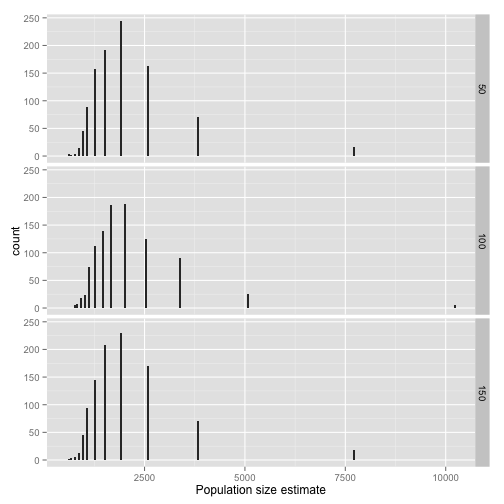
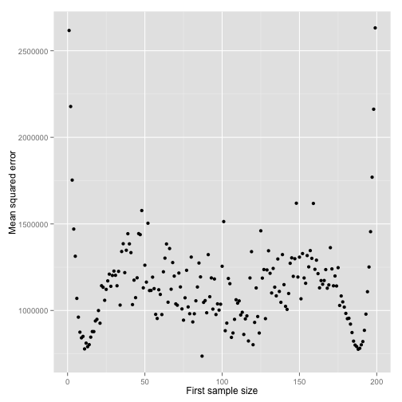
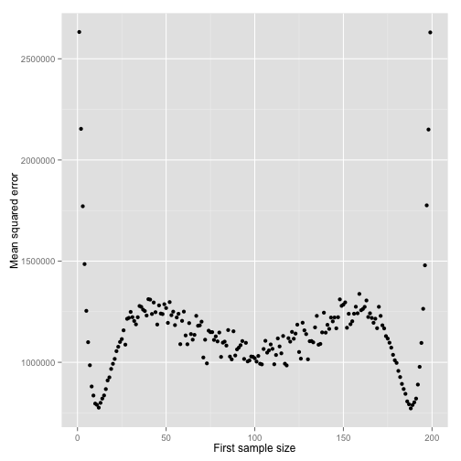
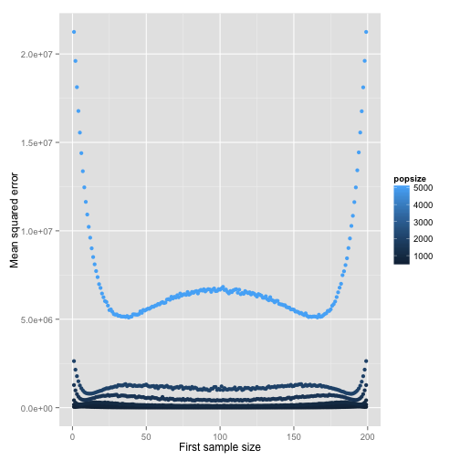

# Simulating Capture Recapture

This is an example of the kinds of simulation code you could use for designing your capture-recapture experiment. You can also treat it as an example of the kind of formatting and reporting that I would expect for a complete computational lab report written with Rmarkdown. You can also download the [original Rmarkdown file](capture_recapture_example.Rmd) (but be aware that if you try to knit this file, it will take a very long time to complete due to the extensive simulations). 

## Setup R and knitr

```r
opts_chunk$set(tidy = FALSE, cache = TRUE, cache.extra = rand_seed, fig.path = "plots/cr_example-")
options(width = 60)

library(ggplot2)
library(plyr)

# set random number seed for reproducability
set.seed(20130703)
```


## Required Functions

We need a few functions just to start off with, before we get to the full simulation. 

First is the function to calculate the Schnabel estimate of population size.

```r
schnabel <- function(first, second, recaught){
  N_est <- (first + 1) * (second + 1) / (recaught + 1) - 1
  return(N_est)
}
#test it
schnabel(150, 50, 3)
```

```
## [1] 1924
```


Then we need our basic simulator, same as in the instructions, just with Schnabel substituted for the previous population size estimator. Note that this returns a data frame with all of the parameters and the results.


```r
simRecapture<- function(popsize, first, second, reps = 1){
  recaught <- rhyper(nn = reps, m = first, n = popsize - first, k = second)
  pop_est <- schnabel(first, second, recaught)
  return(data.frame(popsize, 
                    first, 
                    second, 
                    recaught, 
                    pop_est)
         )
}
#test it
simRecapture(100, 50, 50, reps = 3)
```

```
##   popsize first second recaught pop_est
## 1     100    50     50       28   88.69
## 2     100    50     50       26   95.33
## 3     100    50     50       27   91.89
```


I will also write a function to calculate mean squared error from a data frame with the format returned by my simulation. I will take adavantage of the fact that the data frame always has the true population size listed for every row.

```r
mseSim <- function(sim_df){
  sq_err <- (sim_df$pop_est - sim_df$popsize)^2
  return(mean(sq_err))
}

#test it
my_sims <- simRecapture(100, 50, 50, reps = 5)
mseSim(my_sims)
```

```
## [1] 112.2
```


## First simulations
Now I am ready to do some simulations with varying parameters. I will assume the true population size is 2000 individuals, then simulate with each of the following schemes:  100 caught in each trapping, 150 in the first and 50 in the second, and 50 in the first and 100 in the second. I will do 1000 simulations each, calculating the MSE for each simulation. I can then combine them using `rbind()` (row bind) to put them all into a single data frame, then plot them simultaneously using a facets in `qplot`. I'm going to use smaller bins than would normally be justified, just to highlight the discrete nature of the results.


```r
truepop <- 2000
sim_100x100 <- simRecapture(truepop, 100, 100, reps = 1000)
mseSim(sim_100x100)
```

```
## [1] 1101336
```

```r
sim_150x50 <- simRecapture(truepop, 150, 50, reps = 1000)
mseSim(sim_150x50)
```

```
## [1] 1156806
```

```r
sim_50x150 <- simRecapture(truepop, 50, 150, reps = 1000)
mseSim(sim_50x150)
```

```
## [1] 1121572
```

```r


three_sims <- rbind( sim_100x100, sim_150x50, sim_50x150)
qplot(data = three_sims,
      x = pop_est,
      geom = "histogram",
      binwidth = 50,
      facets = first ~ . , 
      xlab = "Population size estimate")
```

 


## More simulations
Three categories is a bit too few to really judge where the best sampling scheme is, so I will go ahead and test all possible sampling schemes. To do this all at once, I will use plyr, specifically the `mdply()` function, which allows me to give a data frame of arguments to a function, combining all of the results together into a single data frame. So the first step is to make that data frame of arguments (all possible pairs first and second trapping counts), then pass it to `mdply()` with my `simRecapture()` function. The arguments that don't vary I will give separately when I call mdply; it will use the same ones for each call to simRecapture.

```r
sim_args <- data.frame(first = 1:199,
                       second = 199:1)
bigsim <- mdply(.data = sim_args, .fun = simRecapture,
                 popsize = truepop,
                 reps = 1000)
```


I can then calculate the MSE for each of those simulations using `ddply()` and my `mseSim()` function. 

```r
bigsim_mse <- ddply(.data = bigsim, 
                    .variables = .(first),
                    .fun ="mseSim")
qplot(data = bigsim_mse,
      x = first,
      y = mseSim,
      xlab = "First sample size",
      ylab = "Mean squared error")
```

 


That is pretty ugly, especially in the middle, so lets do more replicates per condition to see if we can sort that out.


```r
biggersim <- mdply(.data = sim_args, .fun = simRecapture,
                   popsize = truepop,
                   reps = 1e4)
biggersim_mse <- ddply(.data = biggersim, 
                       .variables = .(first),
                       .fun = "mseSim")
qplot(data = biggersim_mse,
      x = first,
      y = mseSim,
      xlab = "First sample size",
      ylab = "Mean squared error")
```

 


Well, that is certainly interesting... We seem to do well if we are close to 100 & 100, or if we take 11-12 on the first or second try. I wonder if it depends on the true population size... Lets try a few different population sizes. I'll use a function called `expand.grid()` to generate all combinations of two vectors: the true population sizes and the first sample size. 


```r
sim_combos <- expand.grid(popsize = c( 500, 750, 1000, 1500, 2000, 5000), first = 1:199)
sim_combos$second <- 200 - sim_combos$first 

hugesim <- mdply(.data = sim_combos, .fun = simRecapture,
                 reps = 1e4)
```


```r
# simulation in a separate chunk for caching efficiency
hugesim_mse <- ddply(.data = hugesim, 
                     .variables = .(popsize, first),
                     .fun = "mseSim")

qplot(data = hugesim_mse,
      x = first,
      y = mseSim,
      color = popsize,
      xlab = "First sample size",
      ylab = "Mean squared error")
```

 

A bit hard to read, that. Let's convert the popsize to a factor when plotting to make the colors more distinct, transform the MSE to a coefficient of variation(ish) by taking the square root and dividing by the true population size, make the data points smaller, fade them by making them partly transparent with the `alpha` argument, and then add on as smoothing function. If you want details on all of these options, the [ggplot2 website](http://docs.ggplot2.org/) is a good, if technical, resource, as is [Google](http://google.com), as always. You can find a lot by searching.


```r
qplot(data = hugesim_mse,
      x = first,
      y = sqrt(mseSim)/popsize,
      color = factor(popsize),
      alpha = I(0.5),
      xlab = "First sample size",
      ylab = "Mean squared error / True population size") +
  geom_smooth(span = 0.2) + # `span` determines the degree of smoothing in curve
  guides(color = guide_legend("True Population Size"))
```

```
## geom_smooth: method="auto" and size of largest group is
## <1000, so using loess. Use 'method = x' to change the
## smoothing method.
```

 

Well, that is still a bit mysterious. Looks like the lowest error is out toward the ends for many population sizes, but the exact location varies a fair amount. If the population size is very large, you might be better off with a unbalanced strategy, but it seems like the ideal ratio of first to second is pretty sensitive to the assumed population size.  If you think the actual population size is in the thousands, you might want to bias your sample, but what is best for 5000 is not very good for 1500, and vice-versa. Maybe sticking with 100 & 100 would be the best thing to do overall... 

All of this is a pretty good argument for not really trusting a simple point estimate of the population size, and definitely not putting too much weight on our initial guesses.
