## Introduction
One of the most important parts of data analysis is to visualize your data with plots and charts. To paraphrase Yogi Berra: You can see a lot by looking. `R` has lots of powerful tools for creating plots, and you can customize and polish your plots to easily generate graphics worthy of the best scientific paper. There are a number of libraries for making specialized plots and sets of plots, some of which we will explore later in the semester. But for now we will just work on plotting with the built-in graphics. You will see how to make histograms, bar charts, box plots, and scatter plots, and how to customize those plots.

You make plots the same way you do anything else in `R`: you type a command or a series of commands into the console, telling `R` what data to use and how you want the plot to look. At first, this seems much more cumbersome than selecting your data in something like Excel and clicking a plot button, but it has several advantages. They tend to be more customizable, while having much better defaults than Excel. These plots are made for science, not for splashy corporate graphics (not that there is anything wrong with that). The biggest advantage is that once you have a plot that you are satisfied with, creating a similar plot with different data becomes just a matter of copying and pasting the command, replacing only the parts that refer to the data itself.

## Data
The first thing to do is to generate a bit of data for us to plot. We will do this by using the random number generators built into `R`, and some data sets that come with `R`.

First, let's create some random data. The most common distribution in statistics is the normal distribution, so we'll start by having `R` generate random data from that distribution, using the function `rnorm()`.  By default, it uses a mean value of 0 and standard deviation 1, generating as many samples as you ask for in the first argument, `n`. We'll generate three sets of data: one with 20 samples with the default mean and variance, 50 samples with a mean of 5 (and the default standard deviation of 1), and 1000 samples with with a mean of 100 and a standard deviation of 20. 


small_norm <- rnorm(n = 20)
med_norm <- rnorm(50, mean = 5)
large_norm <- rnorm(1000, mean = 100, sd = 20) 


The other data set we will use is a set of measurements of irises (the flower). This data set dates back to the early 20th century, and a paper by R.A. Fisher, who originally developed much of the basic statistics that we use now. But he was fundamentally a biologist, and was also responsible for founding the fields of population genetics and quantitative genetics. Much of his work in statistics was developed to deal with biological data. In any case, the data in the iris data set were originally collected by Edgar Anderson, but made famous by one of Fisher's publications. They are measurements of flower sepals and petals, with 50 measurements of each of 3 species. (If you want a bit more information, try `?iris`.) The commands below load the data, and `attach()` it to the workspace, which makes it easier to get the individual columns of measurements (you won't see them listed as variables in your workspace, but they are there).


data(iris)
attach(iris)
names(iris) #this shows the names of the variables in the iris data.



## [1] "Sepal.Length" "Sepal.Width"  "Petal.Length" "Petal.Width" 
## [5] "Species"


Take some time to look at the raw data (type the name of each variable and look at the output). You will see that `Sepal.Length`, `Sepal.Width`,  `Petal.Length`, and `Petal.Width` are all `numeric`,  data, while `Species` is a `factor`.

## ggplot2
For these exercises, we will mostly focus on the built-in graphics in `R`, but there are a number of packages which present alternative ways of creating plots, and one of the most common is [ggplot2](http://ggplot2.org), written by Hadley Wickham. If you have not already installed it, you can do so with `install.packages("ggplot2")`. For many of the plot types here I will show you how to construct them with either built-in graphics or ggplot2. Sometimes one is easier, and sometimes the other...

## Simple plots
The most basic plotting command in `R` is `plot()`. Lets see what happens when we try it with our random data. *Remember that since we are using randomly generated data, your plots will not look exactly like mine.*


plot(small_norm)


 

So what did that do? Something you almost never want to bother doing: `R` plotted the data values in `small_norm` on the y-axis, with just the position of each value in the vector along the x-axis. Since the order doesn't mean anything, this is probably not the kind of plot we really wanted to produce. But for now, let's stick with it, just to illustrate some of the things you can do to customize plots.

### Labels
If we were just exploring the data in `R`, we might be satisfied with the default label, which `R` takes from the name of the variable. But for any kind of publication (including homework!) you should change the axis labels to inform your readers about what the data represent. We do this with the `xlab` or `ylab` arguments, placing our label in quotes. We can also title the plot using `main`. (Some plots will have a default title. To get rid of it, you can use `main = ""` ).


plot(small_norm, 
     ylab = "My random variable",
     main = "A Bad Plot")


 

We can also change what is being plotted (points, lines, etc.)using `type`, change the color of the points using `col`, and their shape with `pch` (which stands for "point character") and many other options. For a more extensive list, I recommend looking at the reference card available at: <http://cran.r-project.org/doc/contrib/Short-refcard.pdf>, and in particular the "Graphical parameters"" section. I'll use a few different options through this worksheet; see if you can figure out what is doing what by trying different settings yourself.


plot(small_norm, 
     ylab = "My random variable", 
     type = "l")


 

`R` has a number of ways to define the color you want, but often the easiest is to just use one of the predefined colors, like `"blue"`, `"red"`, `"green"`, or `"lemonchiffon3"`. Yeah, the color names get strange. For a complete list of the colors, you can use the `colors()` command, or you could look at the following color chart: <http://research.stowers-institute.org/efg/R/Color/Chart/ColorChart.pdf> to see what they all look like. Note that color names have to be given  as strings with quotes around them (unless you store the color names in your own variable).


plot(med_norm, 
     ylab = "Another random variable",
     col = "firebrick", pch = 18)


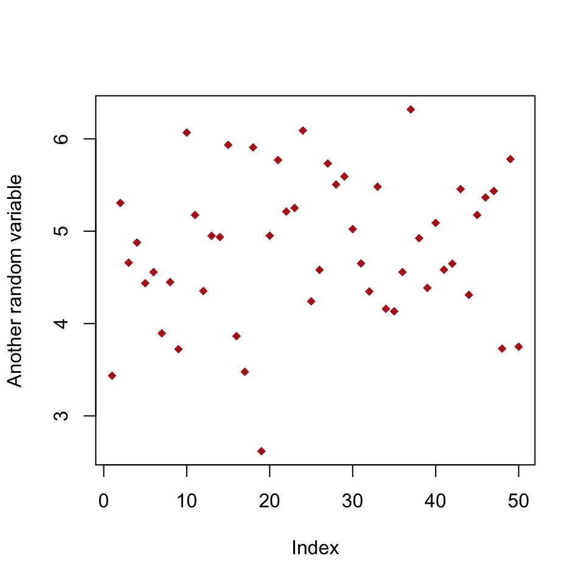 

To see the possible point types, you can make a quick plot using a command like the one below. 


plot(1:20, 
     ylab = "pch value", 
     pch = 1:20,
     col = c("red", "blue") )


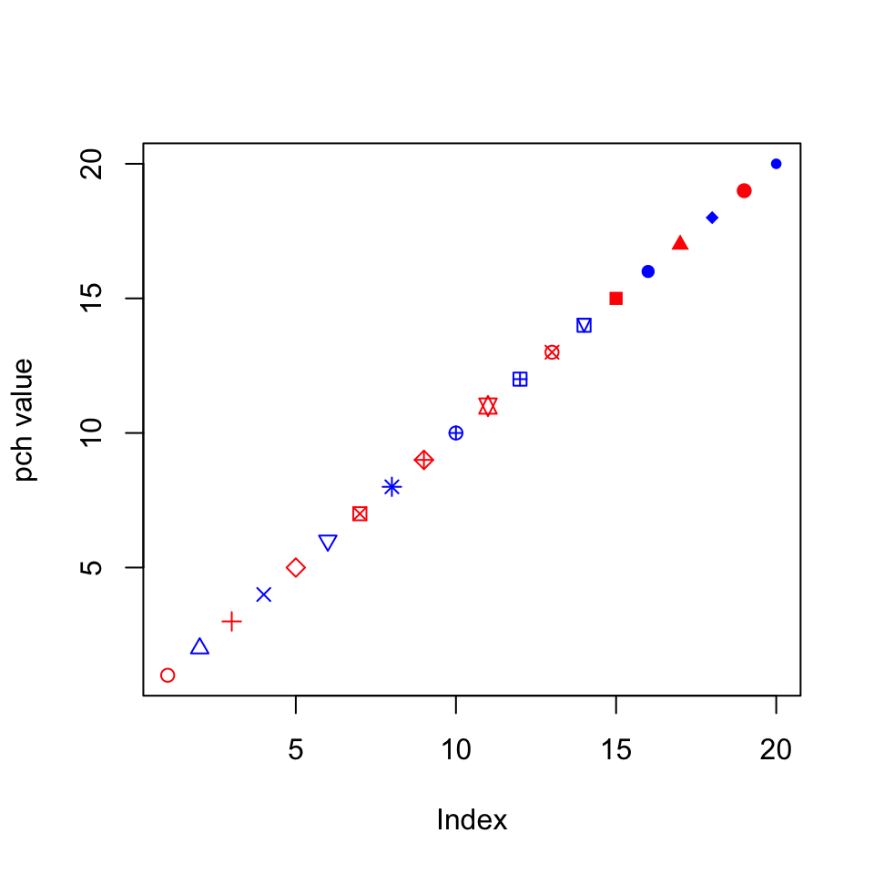 

Notice how I can give the `pch` and `col` arguments vectors, so each point gets a different shape and the colors alternate (because `R` is recycling the vector). You can do the same thing for any other option that affects the appearance of data points, which can be useful for visually separating different subsets of data, or highlighting individual points. 

{: .problem}
Create a plot of the `med_norm` vector where all the points greater than or equal to 5 are blue and all the points less than 5 are green. You will need to create a of color names to do this; the easiest way is to start with a vector of all one color that the same length as the `med_norm` vector, using the `rep()` function, then replace the values that need to change in the next step.  

## Histograms
Since the previous plots were not particularly useful, lets try to do a bit better. We'll start with a basic histogram, which you already saw in your homework assignment.


hist(med_norm)


 

We can adjust the number of divisions in the histogram with `breaks`. When making a histogram, this is probably your most important decision. If you have too many or too few breakpoints, your histogram will not be very informative. There are no hard and fast rules; it depends what you are trying to show with the plot, as well as how much data you have. (Note that `R` will not necessarily give the exact number of breakpoints that you ask for, it does some optimization internally. If you want, you can use `breaks` to specify the exact breakpoints with a vector instead of a single number. This can be useful for precise plots, and also for histograms with unequal bin widths.)


hist(small_norm, 
     breaks = 20, 
     col = "blue",
     main = "Too many breakpoints")


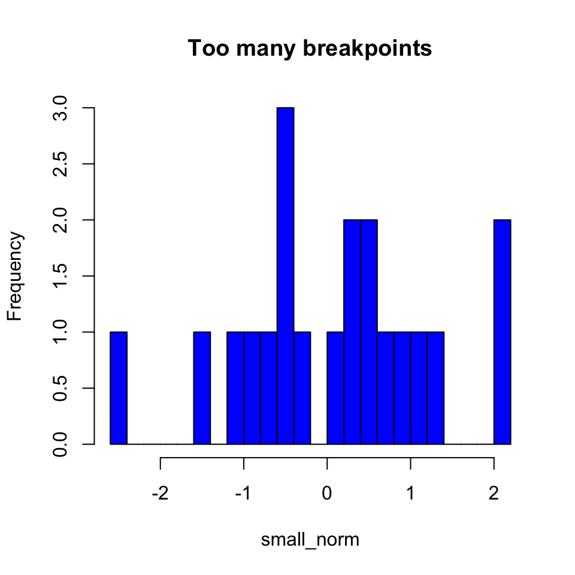 


hist(large_norm, 
     breaks = 20, 
     col = "blue",
     main = "Better with more data")


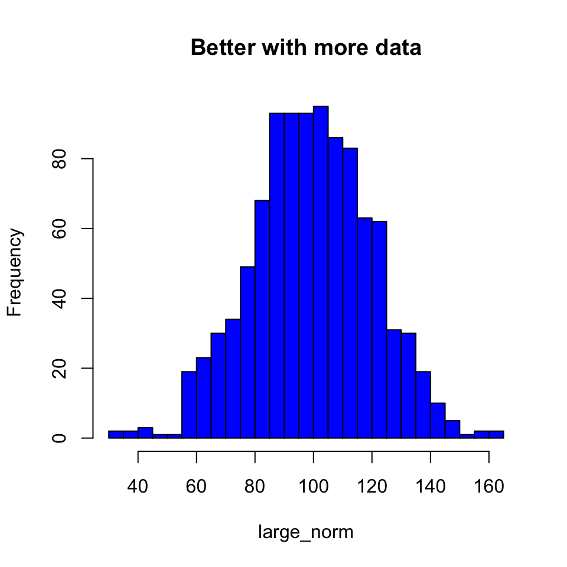 

### ggplot2 Histograms
The basic plotting function in in `ggplot2` is `qplot()`, which can actually make a large number of different kinds of plots, depending on what options you give it. To make a histogram, we will first load the `ggplot2` library (you only need to do this once per session) and then call `qplot()` with a single vector of numbers. Unlike `plot()`, `qplot()` will actually do something reasonable here, and make a histogram rather than just a series of points.


require(ggplot2)
qplot(med_norm)



## stat_bin: binwidth defaulted to range/30. Use 'binwidth = x' to adjust this.


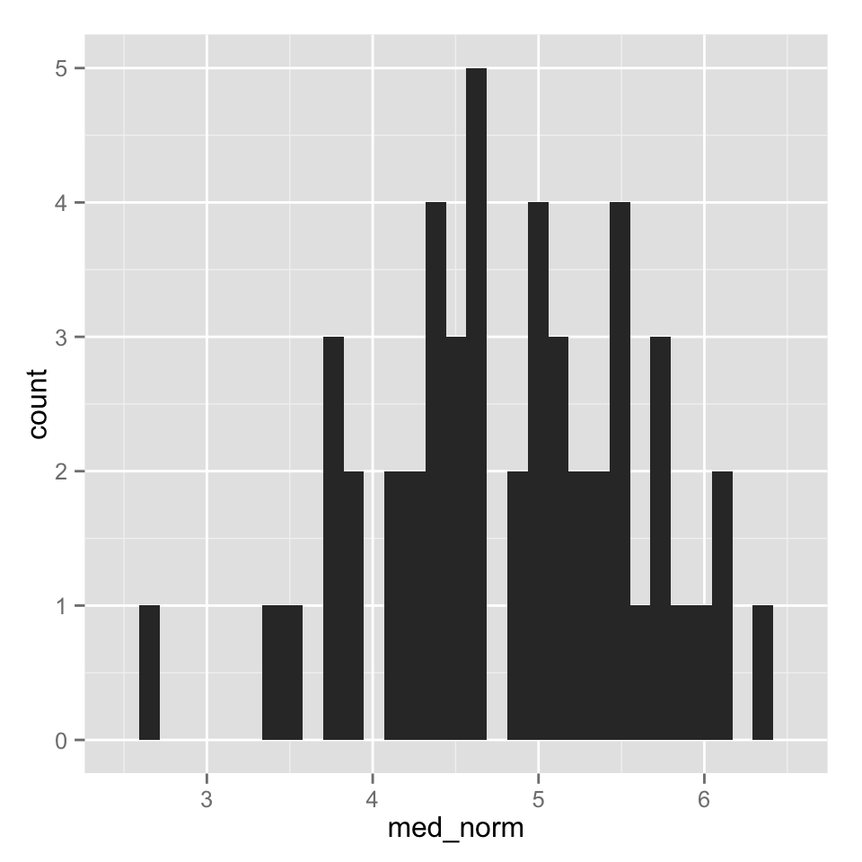 

We got a warning because we did not tell `qplot` about the histogram bins we wanted. Rather than specifying `breaks` as we did with `hist()`, we tell `qplot()` the actual size of the bins we want to use by givint it a `binwidth` argument. Other arguments for axis labels and title are the same is in `hist()`, though we have to use `fill` for the bar colors and enclose the name of color we want in `I()`. (That part is a bit strange, but there are good reasons for it. Ask if you are curious.)


qplot(med_norm,
      binwidth = 0.5,
      main = "YA Histogram",
      xlab = "x",
      fill = I("blue"))


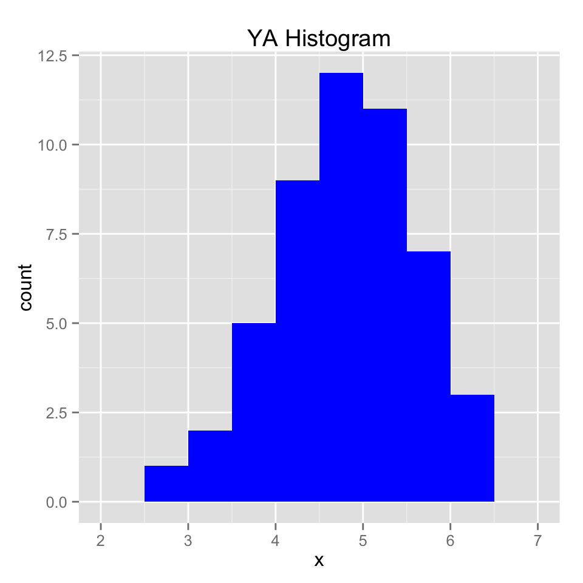 

## Adding to plots
Often you might want to add extra points or lines to a plot, and `R` does allow you do to this in a few different ways. With the base graphics (we'll explore another system later), you can add points, lines, line segments, and rectangles to a plot you have made with commands `points()`, `abline()`, `segments()`, and `rect()`, respectively. For now, we will just use `abline()` to annotate our histogram a bit. Feel free to explore the other commands as well.

To add lines showing the locations of the mean and standard deviations, we can first calculated those, then add them to the plot with `abline()`. The `a` and `b` in `abline()` refer to the equation $y = a + bx$, so you can use it to plot a line at any location with a y-intercept of `a` and a slope of `b`. So if you want a diagonal line that goes through the origin with a slope of 1, you would use the command `abline(a = 0,b = 1)` or simply `abline(0, 1)`. One thing you can't do with that equation is to plot a vertical line, but that can be done by leaving out `a` and `b` and instead giving an x-intercept value or values as the argument `v`, which is what I have done below.


large_mean <- mean(large_norm)
large_sd <- sd(large_norm)
hist(large_norm, 
     breaks = 10)
abline(v = large_mean,
       col = "purple",
       lwd = 2) #lwd controls the line width
abline(v = c(large_mean + large_sd, large_mean - large_sd),
       col = "purple",
       lwd = 2,
       lty = 2) #lty controls the line type, here dashed


 

For `ggplot2`, you add elements to a plot by literally adding things to the `qplot()` function using a `+` sign. To add a vertical line, you add the `geom_vline()` function and specify the `xintercept` argument. As you will see, `ggplot2` tends to be a bit more verbose than the basic graphics. You have to type out things like `color` and `linetype`, but this can make it a bit easier to see what is really going on.


qplot(large_norm, 
      binwidth = 10,
      xlab = "x") +
  geom_vline(xintercept = large_mean,
             color = "purple") +
  geom_vline(xintercept = c(large_mean + large_sd, large_mean - large_sd),
             color = "purple",
             linetype = 2 )


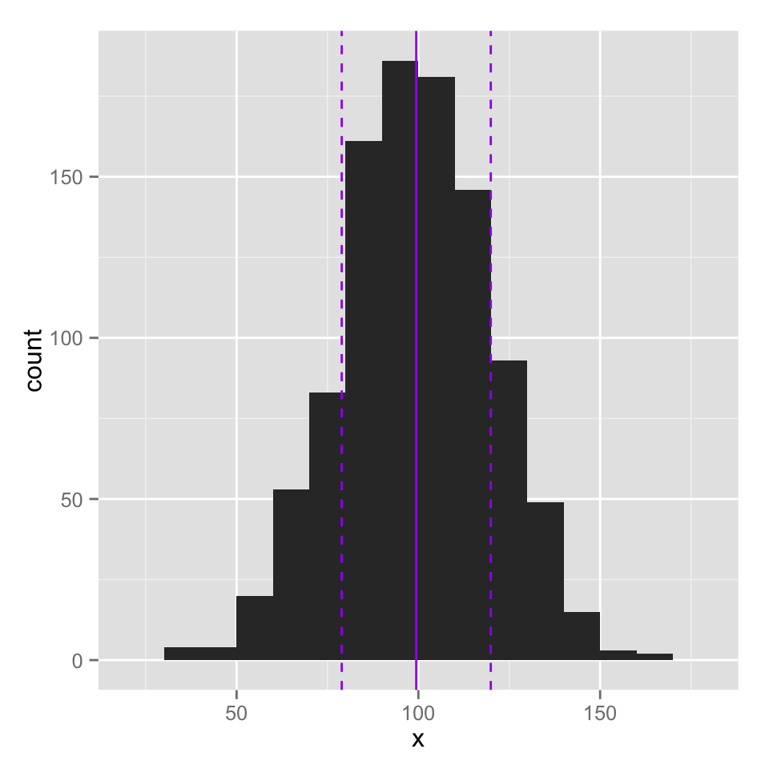 

{: .problem}
Create a histogram of the `large_norm` data with about 100 breakpoints. Is this a good number? Play around with different numbers of breakpoints until you find one that you think is a good representation of the data. Then add vertical lines indicating the median and interquartile range of the data. You will want to use the `quantile()` function to find those quantities.

## Bar charts
To make a bar chart in R, you can use the function `barplot()`. In the simplest case, you have a vector of numbers and a vector of labels. For example, if I were plotting the number of points scored by each team in the NFL Conference Championships this year, I would have the following vectors:


teams <- c("49ers", "Falcons", "Patriots", "Ravens")
points <- c(28, 24, 13, 28 )
team_colors <- c("gold", "red", "blue", "purple")


The first argument of `barplot()` is the height of the bar, and `names.arg` (or just `names`) specifies the labels for each bar. Just like before, we can set the color for each bar with `col` and include nice labels for the axes.
 


barplot(points, names = teams, 
        col = team_colors, 
        ylab = "Points Scored", 
        xlab = "Team")


 

One thing you might have noticed is that the y-axis in this plot does not extend to cover all of the data. `R` has a tendency to do this in its attempts to find "pretty" (their word, not mine) places to put the axis ticks, but you might disagree with its decision about how long a given axis should be. Luckily, you can control this using `xlim` and `ylim`, each of which takes a vector of length 2 with the minimum and maximum values for the axis.


barplot(points, names = teams, 
        col = team_colors, 
        ylim = c(0, 30),
        ylab = "Points Scored", 
        xlab = "Team")


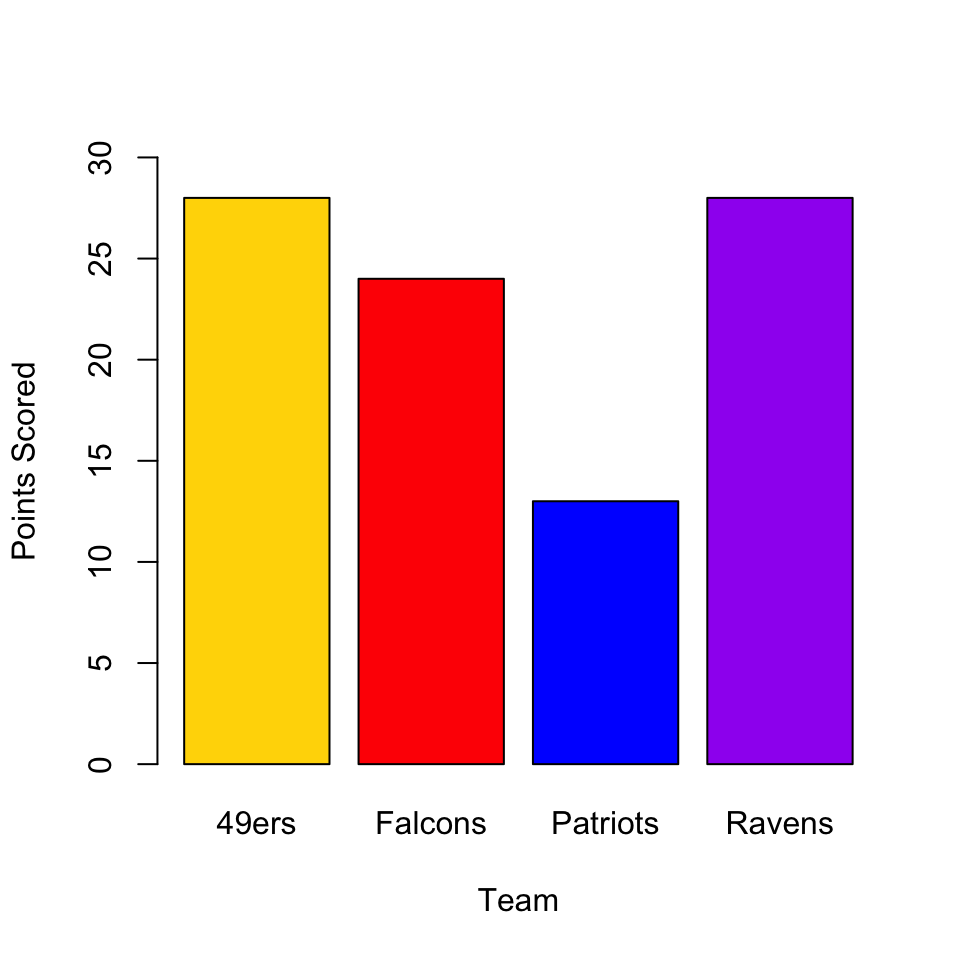 

As the data get more complicated, you might want to start grouping bars (for example to put the teams that actually played each other close together, with larger spaces between matchup pairs), but we will leave that for another time. 

### ggplot2 bar charts
Bar charts can be done in `ggplot2` by adding the argument `geom = "bar"` to a `qplot()` function that has `x` and `y` values. If you want to avoid getting a warning from `ggplot2`, you also have to add an argument of `stat = "identity"`, and you have to wrap the fill colors up in that `I()` function again.  It isn't the prettiest thing in the world, but it does work.


qplot(x = teams, y = points, 
      geom="bar", 
      stat = "identity", 
      fill = I(team_colors))


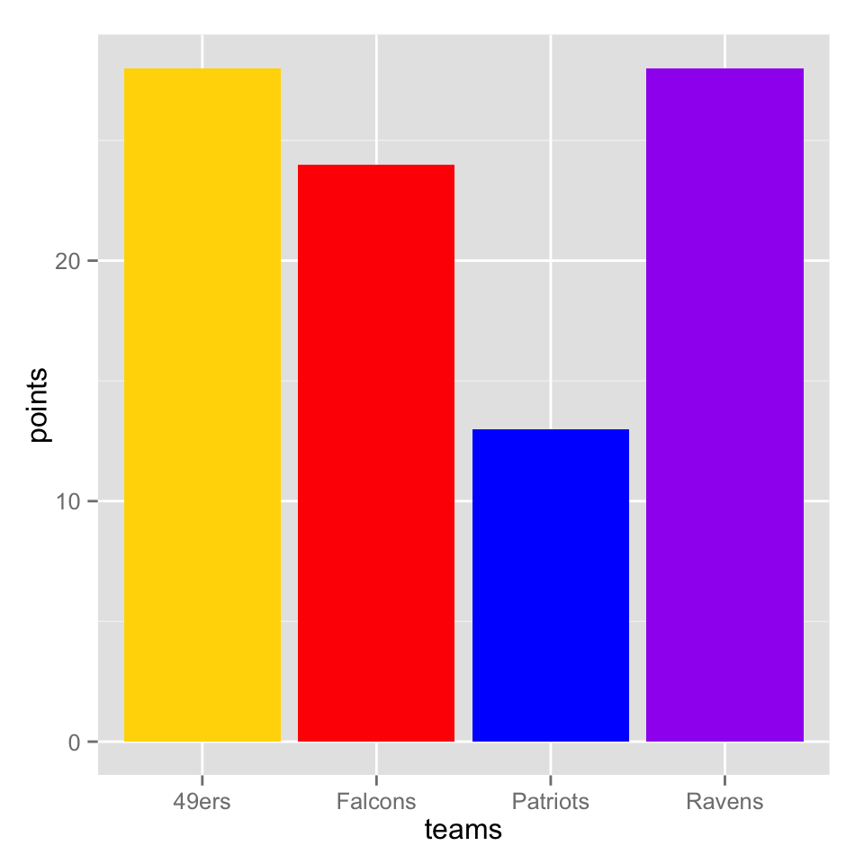 

If you don't use the `I()` function, `ggplot2` will try to intepret the vector you give to `fill` as a factor, and it will assign its own colors (and generate a legend), which can actually be handy:


league <- c("NFC", "NFC", "AFC", "AFC")
qplot(x = teams, y = points, 
      geom="bar", 
      stat = "identity", 
      fill = league)


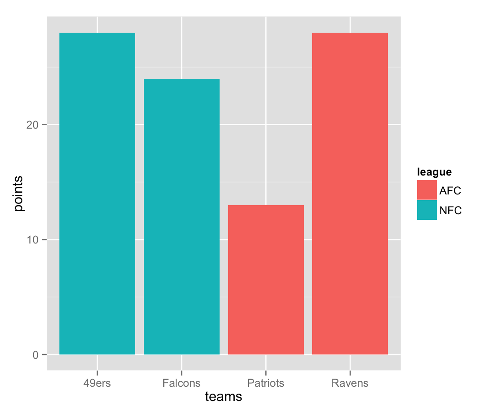 

## Box Plots
Another way we can represent a distribution is with a box plot, which we can make using the function `boxplot()`, of all things. For one variable, the call is simple:


boxplot(Petal.Length, ylab = "Petal Length (cm)")


 

The real utility of box plots though, is to compare distributions in a single plot. To include more than one variable, we need to enclose the variables in a `list`, which is a data structure we have not yet talked about. It is similar to a vector, but can contain elements of different types, including vectors. We could save the list to a variable name of its own, but for now we will just call `list()` within the `boxplot()` function. If To customise the labels for each box, you  use `names`, as in the `barplot()` example.


boxplot(list(Petal.Length, Petal.Width, Sepal.Length, Sepal.Width), 
        names = c("Petal Length", "Petal Width", 
                  "Sepal Length", "Sepal Width"),
        ylab = "centimeters")


 

Another thing we might want to do is to take the iris data and separate out the different species. To do that with base graphics, we have to introduce R formulas. A formula is a way of representing a relationship you want to explore. Take the classic linear relationship: $y = a + bx$. Since in statistical analysis we generally don't know $a$ and $b$ before we start, the R formula expression just leaves them out, and we would represent the relationship between a response variable `y` and an explanatory variable `x` with the formula `y ~ x`. What that is saying is that `y` may depend on `x`, and that is the relationship I want to explore. In the context of the box plot, I want to see if the distributions are different for different species, so I will use the formula `Petal.Length ~ Species`. This is put in as the first argument. 


boxplot(Petal.Length ~ Species, 
        col = c("orange", "purple", "blue"),
        ylab = "Sepal Length (cm)")


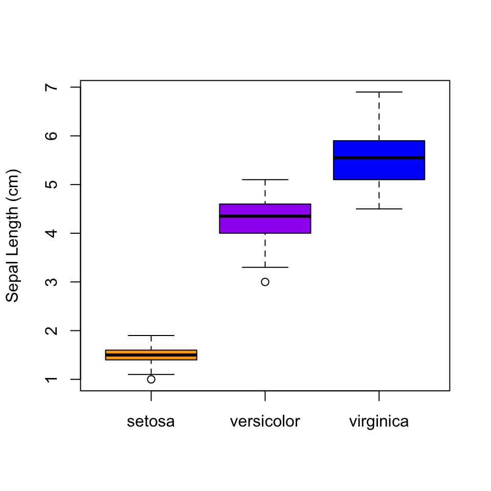 

You should be able to see pretty clearly why plotting all of the species together as we did earlier was a bad idea...

### ggplot2 boxplots
`ggplot2` doesn't use the formula notation for boxplots. Instead you just specify the x and y axis as you might have otherwise expected, then use `geom="boxplot"`:


qplot(x = Species,
      y = Petal.Length,
      geom = "boxplot",
      fill = Species,
      ylab = "Sepal Length (cm)"
      )


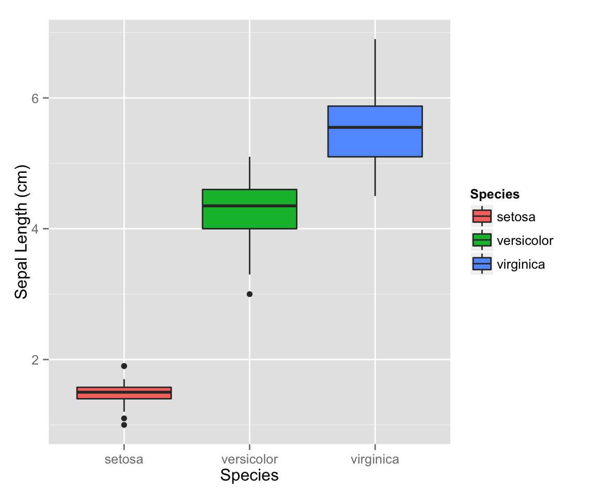 

{: .problem}
Make a boxplot that shows the distribution of the product of petal width and petal length for each individual iris in the data set, split by species. Add a solid horizontal line to your plot that shows the mean of this product across all three the species. Also add a dotted horizontal line that shows the product of mean width and mean length, calculated separately. Are these the same? Why or why not?

## Scatterplots
Finally, lets make some scatterplots. In many ways, these are the easiest to do. Use `plot()`, giving both `x` and `y` values.


plot(x = Sepal.Width, y = Sepal.Length)


 

If you want to add color or shapes to indicate the different species, things get a bit annoying, as we have to assign a color to every single point. Since the data are ordered by species, we can do this quickly with `rep()`, but if they were not, things would get a bit more complicated. If we wanted to do different shapes by species, we would have to make a vector of the shapes as well, which starts to get tedious. We also have to make a legend manually, which I am not even going to try here.


species_colors <- rep(c("orange", "purple", "blue"), each = 50)
plot(x = Sepal.Width, y = Sepal.Length,
     col = species_colors)


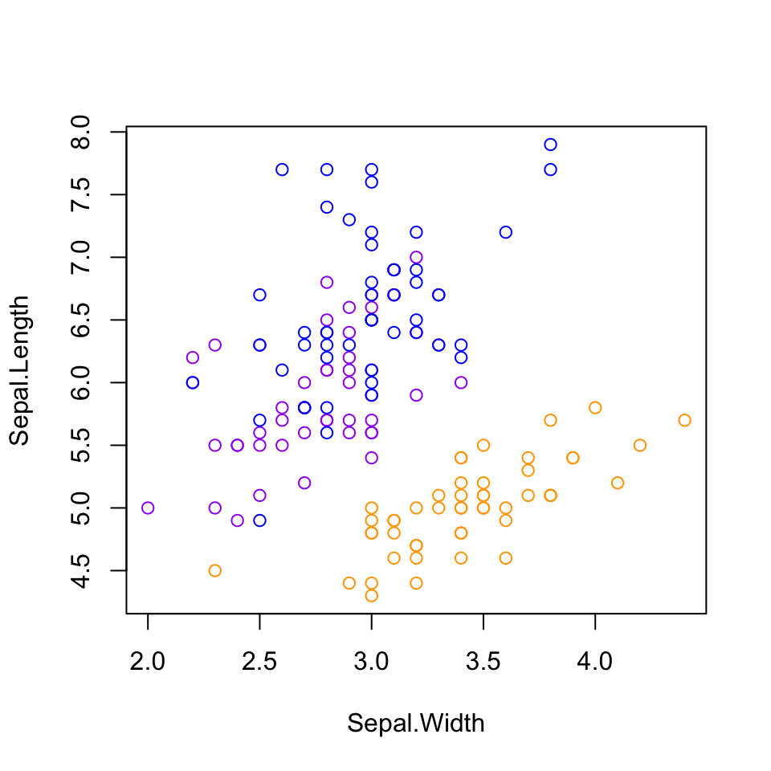 

### ggplot2 scatterplots
With `ggplot2`, making these kinds of plots is much simpler, as long as we are willing to let `ggplot2` choose the colors and shapes (it tends to do a good job, but we could override it with another set of commands that we won't worry about now).


qplot(x = Sepal.Width, y = Sepal.Length,
      color = Species,
      shape = Species)


 

One little problem with this data that you can see is that there are multiple points that overlap, so you can't see all of the points. This is known as overplotting, and one way to get around it is to add a bit of random error ("jitter") to our data, moving all the points just a little bit from their true position. This is easy to do in `ggplot2` without affecting the original data. (This would be much more annoying to do using basic `R` plotting commands.)


qplot(x = Sepal.Width, y = Sepal.Length,
      color = Species,
      shape = Species,
      position = "jitter")


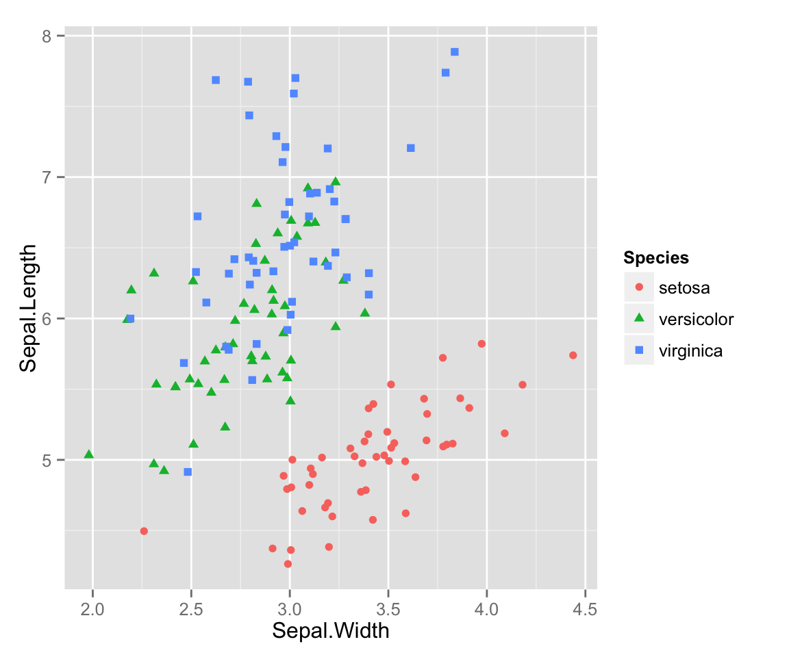 

{: .problem}
Make one more plot to turn in. Use the iris data, and create a plot that illustrates something you find interesting about that data, then write a caption explaining what the plot shows. Make sure your plot is fully labelled. Extra points for using a feature of plotting in `R` that was not discussed on this page, either from base graphics or `ggplot2`. (Some suggestions: density plots, transparency, facets, varible point sizes, continuous color scales, fit lines, or smoothing curves). You may find the examples available at [ggplot2.org](http://ggplot2.org) to be helpful, especially the example chapter from the [ggplot2 book](http://ggplot2.org/book/): "Getting started with qplot" \[[PDF](http://ggplot2.org/book/qplot.pdf)\].

